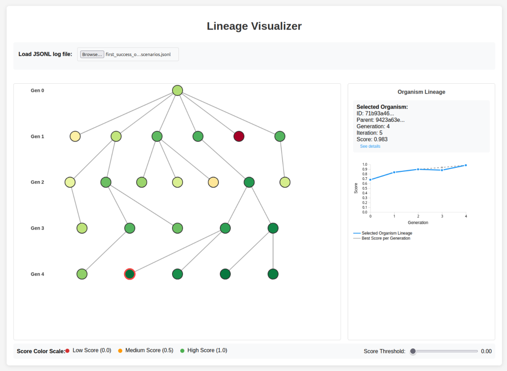
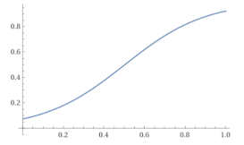
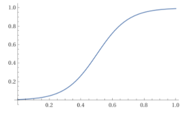
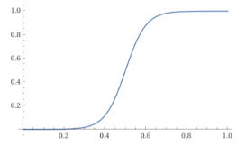
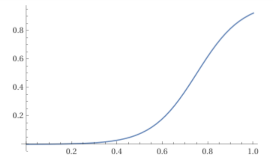

# Darwinian Evolution Inspired Framework for Evolving Code and Prompts

This folder contains a light-weight framework that can be applied to a range of different problems.

The core idea: Darwinian-evolver maintains a population of solutions (organisms). In each iteration, it selects promising parents from the population, creates new variations of them (mutation), and scores their performance (evaluation). The best solutions survive and reproduce, gradually evolving toward an ever improving solution.

Darwinian-evolver is inspired by Darwin Goedel Machines (https://arxiv.org/abs/2505.22954), but doesn't necessarily include self-improvement (the Goedel in Darwin Goedel Machines).

To optimize any prompt or piece of code with Darwinian-evolver, you only need to provide three components:
1. Initial organism: The initial solution you want to improve. This could be a Python function, a prompt template, or any other piece of code.
2. Evaluator: A data set or function that quantitatively scores an organism. It must return a numeric score and identify specific failure cases (e.g., an input where the code produced the wrong output).
3. Mutator: A prompt or agent (typically powered by an LLM) that takes an organism and a failure case and attempts to generate an improved version.

Darwinian-evolver orchestrates the evolutionary process. A key strength is its resilience - the approach works even with noisy evaluators or unreliable mutators. If your mutator only produces a better solution 20% of the time, Darwinian-evolver can still leverage those successes to drive progress.

## Quick Start

You can run a simple example problem called "parrot" using the following command:

```bash
uv run darwinian_evolver parrot --num_iterations 3 --output_dir /tmp/parrot_output
```

This command runs the evolutionary process for 3 iterations and logs all results.

See `uv run darwinian_evolver --help` to learn about other available options. The `--output_dir` option creates an output directory containing:
- `results.jsonl` - JSON log of the evolution process
- `snapshots/` - Population snapshots after each iteration
- Additional outputs that may be written by individual evaluators

### Visualizing the Results

After running, you can open the included `lineage_visualizer.html` file in your browser to load the json log file and inspect the evolutionary history of the population.



## Creating Your Own Problem

To adapt Darwinian-evolver to your own use case, you need to define a `Problem` by implementing a few key classes. See `problem.py` for the base interfaces and `problems/parrot.py` for a simple example.


A Problem is composed of the following:
```py
class Problem(Generic[OrganismT, EvaluationResultT, EvaluationFailureCaseT]):
    initial_organism: OrganismT
    evaluator: Evaluator[OrganismT, EvaluationResultT, EvaluationFailureCaseT]
    mutators: list[Mutator[OrganismT, EvaluationFailureCaseT]]
```

Here’s a step-by-step guide to setting up your implementation.

### 1. Define Your `Organism`

Create a subclass of `Organism` to hold the data that will be evolved. This could contain a prompt template, a block of code, or even a git hash.

```py
# Example Organism
class MyPromptOrganism(Organism):
    prompt_template: str
```

### 2. Implement the `Evaluator`

Your `Evaluator` subclass needs a single method, `evaluate`, which scores an organism's performance. It should return an `EvaluationResult` containing a numeric score and a list of `EvaluationFailureCases`.

You'll likely want to subclass `EvaluationFailureCase` to pass information about a given failure from your evaluator to your mutators.

```py
class MyEvaluator(Evaluator[MyPromptOrganism, EvaluationResult, MyFailureCase]):
    def evaluate(self, organism: MyPromptOrganism) -> EvaluationResult:
        # ... logic to test the organism's prompt ...
        score = 0.85
        failures = [
            MyFailureCase(input="...", expected_output="...", actual_output="...")
        ]
        return EvaluationResult(score=score, trainable_failure_cases=failures)
```

### 3. Implement at Least One `Mutator`

A `Mutator` takes an organism and a failure case and tries to produce one or more new, improved organisms. This is where you'll typically call an LLM or invoke a coding agent to automatically implement a change to the organism.

```py
class MyMutator(Mutator[MyPromptOrganism, MyFailureCase]):
    def mutate(
        self,
        organism: MyPromptOrganism,
        failure_cases: list[MyFailureCase],
        learning_log_entries: list[LearningLogEntry],
    ) -> list[MyPromptOrganism]:
        # Unless you enable batch mutations, you can assume that there's exactly
        # one failure case passed into a given mutate call.
        failure_case = failure_cases[0]

        failure_diagnosis = llm.diagnose_failure(organism.prompt_template, failure_case)
        # ... use an LLM to generate a new prompt based on the failure diagnosis ...
        new_prompt = llm.generate_fix(organism.prompt_template, failure_diagnosis)

        # Return a list of new candidate organisms
        return [MyPromptOrganism(prompt_template=new_prompt)]
```

### Notes on Mutators
A typical mutator will first use an LLM to inspect the given organism and failure case, and generate a diagnosis of what might have gone wrong. The LLM should propose an improvement to the organism with the goal of avoiding this type of failure moving forward. In a second step, the mutator will generate an updated organism by implementing the proposal.

For example, Darwin Goedel Machines (https://arxiv.org/pdf/2505.22954) use the prompt given in appendix "A.3 Self-Improve Prompts". The improvement proposal is then handed to the coding agent for implementation.

Mutators can be *static* or *self-improving*:
* A *static mutator* uses fixed, external logic (like a call to a specific LLM API) to generate improvements.
* A *self-improving mutator* uses the organism itself to generate the mutation. This is common when the organisms being evolved are themselves capable agents (e.g., an AI coding agent improving its own source code).

Self-improving mutators are what Darwin Goedel Machines are based on. They rely on an assumption that an improved score from the evaluator implies (at least directionally) an improved ability to improve themselves as well.

## Sampling Parameters

Weighted sampling is used to select a certain number (`--num_parents_per_iteration`) of parent organisms in each iteration. The sampling weight is proportional to the product of two components:
* the sigmoid-scaled performance score
* a novelty bonus for parents that have fewer existing children

See Appendix A.2 of https://arxiv.org/pdf/2505.22954 for the detailed formulas.

The sigmoid function used for scaling the performance score can be configured with two parameters: The sharpness (`--sharpness`) and midpoint score (`--midpoint_score`).

The midpoint score can be specified in two ways:
1. **Fixed value**: A numeric value (e.g., `--midpoint_score 0.5`)
2. **Percentile tracking**: Using the syntax `pXX` where XX is a percentile from 0-100 (e.g., `--midpoint_score p75`)

By default, the midpoint score is set to `p75`, which tracks the 75th percentile of the current population after each iteration. The sharpness defaults to 10.

The parameters can be adjusted to fit an expected score range, or to prioritize between exploiting the highest-scoring organisms and generating more diverse populations. Below are a few example plots of the sigmoid score scaling function for illustration:

**midpoint_score=0.5, sharpness=5**



**midpoint_score=0.5, sharpness=10 (default)**



**midpoint_score=0.5, sharpness=20**



**midpoint_score=0.75, sharpness=10**



## Advanced Features

Darwinian-evolver implements a few features that were not present in the original Darwin Goedel Machine implementation. These largely serve the purpose of increasing the efficiency (in both cost and time) of an evolver run.

### Batch Mutations
Rather than only passing a single failure case to a mutator at a time, you can pass the `--batch_size` parameter to pass a small sampling of failure cases at once. Typical values for `--batch_size` are in the range of 2-5.

*Benefits:*
- Larger batch sizes can increase the likelihood that a given mutation is useful
- Gives the mutators more data points to work with and extract meaningful patterns

*Downsides:*
- Can lead to a decrease in the diversity of the resulting mutations, which ultimately can make it harder to escape local optima
- Requires mutators that support batch inputs
- LLM-based mutators in particular can suffer from performance degradation when presented with too much data at once, ultimately reducing the quality of the generated mutations

To use batch mutations with your problem, you'll need to:
1. Implement at least one mutator that can process multiple failure_cases in its `mutate` method. You can check the multiplication_verifier problem for an example of such a mutator.
2. Override the `supports_batch_mutation` property on that mutator:
```py
@property
def supports_batch_mutation(self) -> bool:
    return True
```
3. Optional: Categorize the types of failures that can occur during evaluation (e.g. false positives vs. false negatives), and set the `failure_type` property on the generated FailureCases. To make the job of the mutator easier, batches will always be constructed of failure cases of a single type only.
4. Pass the `--batch_size <int>` command line option to enable batching.

### Weighted Failure Case Sampling
You can steer which failure cases get passed to your mutators by defining different failure types and assigning weights to each type.

By default, failure cases will be sampled uniformly from the `trainable_failure_cases` property of an `EvaluationResult`.

To implement weighted failure case sampling for your problem:
1. Categorize the types of failures that can occur during evaluation (e.g. false positives vs. false negatives), and set the `failure_type` property on the generated FailureCases.
2. Override the `failure_type_weights` property on your `EvaluationResult` subclass:
```py
@property
def failure_type_weights(self) -> dict[str, float]:
    # Over-sample false positives by a factor of 2:1.
    return {
        "false_positive": 2.0,
        "false_negative": 1.0,
    }
```

If you need even more control, you can override the `sample_trainable_failure_cases` method on your `EvaluationResult` class.

### Post-Mutation Verification
By default, every mutated organism generated by a mutator will be fully evaluated and then added to the population.

Post-mutation verification adds an additional filter step right after the mutator. If a mutation fails this verification step, it will skip the full evaluation and will not be added to the population. Typically, post-mutation verification will check whether the mutation actually improves on the failure cases that had been passed to the mutator.

*Benefits:*
- Can significantly improve the quality of mutations that get added to the population, thereby increasing the efficiency of the optimization process
- Makes sure that only mutations that have meaningful changes in their performance characteristics get considered
- Can significantly reduce the number of full evaluations that need to be performed, which is especially useful if full evaluations are slow and/or costly

*Downsides & Limitations:*
- Can reduce the diversity of organisms in the population and make it harder to escape a local optimum
- Can introduce a bias towards mutations that are overly specific to fixing failures on just one particular data point and thereby encourage over-fitting
- Requires that evaluation results on a given data point are (mostly) consistent across runs. If the evaluation results on a given data point have high variance, then verification results cease to be indicative of a mutation's true performance characteristics.
- Requires that a single mutation step can plausibly remove a given failure case. Some problems require a sequence of mutations before a given failure case is fully resolved. Post-mutation verification can stop those problems from making any progress, as mutations that could eventually prove useful will be dismissed.

To use post-mutation verification on your problem:
1. Implement the `verify_mutation` method on your `Evaluator` class. Here is an example implementation from the multiplication_verifier problem:
```py
def verify_mutation(
    self,
    organism: MultiplicationVerifierOrganism,
    failure_cases: list[MultiplicationVerifierEvaluationFailureCase],
) -> bool:
    """Verify that the mutation of the organism has addressed at least one of the given failure cases."""
    for failure_case in failure_cases:
        data_point = failure_case.data_point
        maybe_failure_case = self._evaluate_data_point(organism, data_point)
        if maybe_failure_case is None:
            # If the mutation did no longer produce a failure case for this data point, we consider it a success.
            return True

    return False
```
2. Pass the `--verify_mutations` command line option to enable post-mutation verification.


### Learning Log
The learning log provides a way for generating learnings from a mutate->evaluate cycle, and then exposing a subset of them to mutators.

This improves the sharing of key insights between organisms, and allows mutators to draw lessons from previously attempted changes, whether successful or not.

An entry in the learning log consists of two parts:
1. A summary of the change that a mutator attempted (the `attempted_change`)
2. An observed outcome of how this change affected the evaluation performance of the resulting organism (the `observed_outcome`)

There are different strategies for which specific learning log entries are made available when mutating a given organism, which are:
1. `none`: Don't pass any learning log entries, effectively disabling the learning log (default)
2. `ancestors`: Pass learning logs from all ancestors of the given organism
3. `neighborhood-N`, with N being a natural number (e.g. `neighborhood-2`): Pass learning logs from all organisms that are no more than N steps away from the given organism at the time of mutation. A step corresponds to one mutation / ancestry relationship. E.g. for `neighborhood-1`, the learning logs from the organism's parent as well as its existing direct children will be made available. For `neighborhood-2`, siblings, grandchildren and grandparents will additionally be included.

To use the learning log with your problem:
1. Have your mutator(s) set the `from_change_summary` field on the generated organisms. This field should be populated with a specific but concise summary of what change the mutator made when generating that organism, compared to its parent.
2. Make your mutator use `learning_log_entries` argument, typically by formatting them into an LLM prompt or similar.
3. Optional: Customize the observed outcome that gets associated with a change. The observed outcome is derived from the `EvaluationResult` of the resulting organism, in reference to the `EvaluationResult` of its parent. By default, the score of the resulting organism is compared to the parent's score. You can customize which details get included in the outcome by overwriting the following method on your `EvaluationResult` subclass:
```py
def format_observed_outcome(self, parent_result: EvaluationResult | None) -> str:
    ...
```
3. Pass the `--learning_log` command line option with the desired strategy (e.g. `--learning_log neighborhood-2`)
